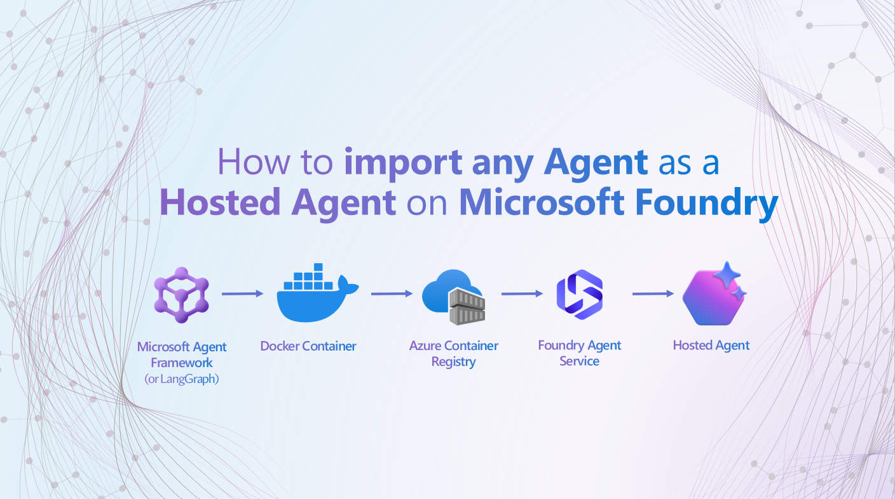

# Agent Framework 에이전트를 Microsoft Foundry용 컨테이너로 만들기

**[🇺🇸 English](README.md)** | **🇰🇷 한국어**

> **참고:** 이 리포지터리는 [leyredelacalzada/hr-hosted-agent](https://github.com/leyredelacalzada/hr-hosted-agent)의 fork 버전입니다. 원본 리포지터리의 변경 사항을 최선을 다해 동기화하고 있습니다.



이 리포지터리는 [Microsoft Agent Framework](https://github.com/microsoft/agent-framework) 에이전트를 컨테이너화하고 [Microsoft Foundry Agent Service](https://learn.microsoft.com/ko-kr/azure/foundry/agents/concepts/hosted-agents)에 **호스팅 에이전트**로 배포하기 위한 **템플릿 + 튜토리얼**입니다.

포함된 HR 에이전트는 **샘플**일 뿐입니다 — Agent Framework로 만든 자체 에이전트로 교체할 수 있습니다.

---

## 작동 방식

Foundry 호스팅 에이전트는 REST API를 제공하는 Docker 컨테이너입니다. 에이전트가 HTTP 서버로 컨테이너 내부에서 실행됩니다. Foundry가 스케일링, ID, 네트워킹, 모니터링을 관리하며 — 사용자는 컨테이너 이미지만 제공하면 됩니다.

핵심 기술은 **호스팅 어댑터** (`from_agent_framework()`)로, 모든 `ChatAgent`를 포트 8088의 Uvicorn 웹 서버로 래핑합니다:

```text
Your ChatAgent  →  from_agent_framework(agent).run()  →  HTTP server (:8088)
                                                            ├── POST /responses   (OpenAI Responses API)
                                                            └── GET  /readiness   (헬스 체크)
```

Foundry가 `POST /responses`로 사용자 메시지를 보내면, 에이전트가 처리하고 같은 엔드포인트를 통해 응답을 반환합니다.

---

## 단계별 가이드

### Step 0: 에이전트 빌드 (또는 샘플 사용)

`original/hr_agent.py` 파일은 **샘플 에이전트**입니다 — Azure AI Search 지식 기반을 사용하여 HR 질문에 답변하는 독립 실행형 Agent Framework 스크립트입니다. 컨테이너화 전 일반적인 에이전트가 어떻게 생겼는지 보여주기 위한 참고용으로만 포함되어 있습니다.

**이 에이전트를 사용할 필요는 없습니다.** Microsoft Agent Framework로 만든 자체 에이전트로 교체하세요.

### Step 1: 호스팅용 에이전트 수정 (`main.py`)

`main.py`가 컨테이너화가 이루어지는 곳입니다. 에이전트 로직을 가져와 호스팅 어댑터로 래핑합니다. 파일에 상세한 주석이 있습니다 — 열어서 필수 항목과 선택 항목을 확인하세요.

**반드시 해야 할 4가지:**

1. `ChatAgent` 사용 (`Agent` 아님) — 호스팅 어댑터가 이 클래스를 요구합니다
2. 동기 `DefaultAzureCredential` 사용 (비동기 아님) — 어댑터가 내부적으로 비동기를 관리합니다
3. 인스트럭션과 컨텍스트 프로바이더로 `ChatAgent`를 빌드합니다
4. `from_agent_framework(agent).run()` 호출 — HTTP 서버를 시작합니다

**자체 에이전트로 교체**하려면 `main.py`를 편집하세요:

- `HR_INSTRUCTIONS`를 에이전트의 시스템 프롬프트로 교체
- `AzureAISearchContextProvider`를 에이전트의 도구나 컨텍스트 프로바이더로 교체/제거 (없으면 `context_providers=[]` 사용)
- `ChatAgent` 생성자에서 `name`과 `id` 업데이트

### Step 2: 컨테이너화 (`Dockerfile`)

Dockerfile이 에이전트를 Docker 이미지로 패키징합니다:

```bash
# 이미지 빌드 (항상 linux/amd64를 타겟으로 — Foundry는 AMD64에서 실행됩니다)
docker build --platform linux/amd64 -t my-agent:latest .
```

이미지는 Python 3.12을 사용하고, `uv`로 의존성을 설치하며 (`pyproject.toml` 사용), `main.py`를 엔트리포인트로 실행합니다. 호스팅 어댑터용으로 포트 8088이 노출됩니다.

### Step 3: Azure Container Registry에 푸시

컨테이너 이미지를 저장할 ACR이 필요합니다. Foundry가 배포 시 여기서 이미지를 가져옵니다.

```bash
# ACR 생성 (1회)
az acr create --name <your-acr-name> --resource-group <your-rg> --sku Basic

# 로그인, 태그, 푸시
az acr login --name <your-acr-name>
docker tag my-agent:latest <your-acr-name>.azurecr.io/my-agent:latest
docker push <your-acr-name>.azurecr.io/my-agent:latest
```

### Step 4: Foundry에 에이전트 등록 (`deploy.py`)

`deploy.py`는 `azure-ai-projects` SDK를 사용하여 Foundry에 컨테이너를 등록합니다:

```bash
# 환경 변수 설정
export AZURE_AI_PROJECT_ENDPOINT="https://<your-resource>.services.ai.azure.com/api/projects/<your-project>"
export CONTAINER_IMAGE="<your-acr-name>.azurecr.io/my-agent:latest"
export AZURE_SEARCH_ENDPOINT="https://<your-search>.search.windows.net"

# 로그인 후 배포
az login
python deploy.py
```

이 명령어는 Foundry에 컨테이너 이미지, 리소스 할당 (CPU/메모리), 에이전트가 런타임에 필요한 환경 변수와 함께 에이전트 항목을 생성합니다.

**자신의 에이전트에 맞게 커스터마이즈**하려면 `deploy.py`를 편집하세요:

- `AGENT_NAME`과 `description` 변경
- `environment_variables`를 에이전트가 `os.getenv()`로 읽는 값에 맞게 업데이트

### Step 5: Foundry에서 에이전트 시작

**Foundry 포털** → **Agents** → 에이전트 찾기 → **Start** 클릭. Foundry가 ACR에서 이미지를 가져와 컨테이너를 시작하고 요청을 라우팅합니다.

---

## 프로젝트 구조

```text
hr-hosted-agent/
├── main.py                   # ⭐ 호스팅 에이전트 엔트리포인트 (컨테이너화 레이어)
├── original/
│   └── hr_agent.py           # 📋 샘플 에이전트 코드 (독립 실행형, 참고용)
├── Dockerfile                # 🐳 컨테이너 이미지 정의
├── deploy.py                 # 🚀 Foundry에 에이전트를 등록하는 SDK 스크립트
├── pyproject.toml            # 📦 Python 의존성 (uv 프로젝트 파일)
├── agent.yaml                # 📄 에이전트 메타데이터 (azd CLI 배포용)
├── .env.example              # 🔑 환경 변수 템플릿
├── .gitignore
└── README.md
```

### 각 파일의 역할

| 파일 | 용도 | 편집 필요? |
| --- | --- | --- |
| `main.py` | 호스팅 어댑터로 에이전트를 래핑하여 컨테이너화 | **예** — 샘플 에이전트 로직을 교체 |
| `original/hr_agent.py` | 샘플 독립 에이전트 (참고용, 컨테이너에서 미사용) | 아니오 — 참고용 |
| `Dockerfile` | 컨테이너 이미지 빌드 | 거의 없음 — 추가 파일이 있을 때만 |
| `deploy.py` | SDK를 통해 Foundry에 에이전트 등록 | **예** — 에이전트 이름, 설명, 환경 변수 업데이트 |
| `pyproject.toml` | Python 의존성 (uv 프로젝트 파일) | 추가 패키지가 필요할 때만 |
| `agent.yaml` | 선언적 에이전트 정의 (deploy.py 대안, `azd` CLI용) | 선택사항 |
| `.env.example` | 환경 변수 템플릿 | 로컬 개발 시 `.env`로 복사 |

---

## 변경 사항: 원본 에이전트 → 호스팅 에이전트

| 항목 | 원본 (`original/hr_agent.py`) | 호스팅 (`main.py`) |
| --- | --- | --- |
| **클래스** | `Agent` | `ChatAgent` |
| **실행 방식** | 일회성 비동기 스크립트 (`asyncio.run`) | 장기 실행 HTTP 서버 (Uvicorn, :8088) |
| **인증** | 비동기 `DefaultAzureCredential` | 동기 `DefaultAzureCredential` |
| **엔트리포인트** | `asyncio.run(main())` | `from_agent_framework(agent).run()` |
| **API** | 없음 — 콘솔 출력 | REST: `POST /responses`, `GET /readiness` |
| **패키징** | Python 스크립트 | Docker 컨테이너 |
| **배포** | 로컬 실행 | Foundry Agent Service (관리형) |
| **관찰성** | 없음 | 내장 OpenTelemetry |

---

## 사전 요구 사항

### 로컬 도구

- **Python 3.12+**
- **[uv](https://docs.astral.sh/uv/)** — 빠른 Python 패키지 매니저
- **[Azure CLI](https://learn.microsoft.com/ko-kr/cli/azure/install-azure-cli)** — `az login` 및 ACR 작업용
- **[Docker](https://docs.docker.com/get-docker/)** — 컨테이너 이미지 빌드용

### Azure 리소스

이 데모를 전체 실행하는 데 필요한 Azure 리소스:

| 리소스 | 용도 | 필수? |
| --- | --- | --- |
| **[Azure AI Foundry 프로젝트](https://learn.microsoft.com/ko-kr/azure/foundry/foundry-portal/create-project)** | 에이전트 호스팅, 프로젝트 엔드포인트 제공, 에이전트 수명 주기 관리 | 예 |
| **[Azure OpenAI Service](https://learn.microsoft.com/ko-kr/azure/ai-services/openai/overview)** (모델 배포) | 에이전트를 구동하는 LLM (예: `gpt-4.1`). Foundry 프로젝트 내부에서 생성. | 예 |
| **[Azure Container Registry (ACR)](https://learn.microsoft.com/ko-kr/azure/container-registry/container-registry-intro)** | Docker 이미지 저장. Foundry가 배포 시 여기서 이미지를 가져옴. | 예 |
| **[Azure AI Search](https://learn.microsoft.com/ko-kr/azure/search/search-what-is-azure-search)** | 그라운딩용 지식 기반 (HR 샘플은 인덱스 `kb1-hr` 사용). | 에이전트가 지식 기반 그라운딩을 사용할 때만 |
| **[Azure Storage Account](https://learn.microsoft.com/ko-kr/azure/storage/common/storage-account-overview)** | Foundry 프로젝트가 내부 상태 관리용으로 자동 프로비저닝. 직접 접근 불필요. | 자동 생성 |

> **RBAC:** Foundry 프로젝트의 관리 ID에 ACR에 대한 **AcrPull** 권한이 필요하며, AI Search를 사용하는 경우 검색 서비스에 대한 **Search Index Data Reader** 권한도 필요합니다.

### 아키텍처 다이어그램

```text
┌─────────────────────────────────────────────────────────┐
│                   Azure AI Foundry                       │
│                                                          │
│   ┌──────────────┐     이미지 풀      ┌─────────────┐  │
│   │ Hosted Agent  │◄────────────────────│     ACR     │  │
│   │ (컨테이너)    │                     └─────────────┘  │
│   │  :8088        │                                      │
│   └──────┬───────┘                                      │
│          │ 호출                                          │
│          ▼                                               │
│   ┌──────────────┐     ┌──────────────────┐             │
│   │ Azure OpenAI  │     │  Azure AI Search  │             │
│   │ (gpt-4.1)     │     │  (지식 기반)       │             │
│   └──────────────┘     └──────────────────┘             │
└─────────────────────────────────────────────────────────┘
```

## 의존성

| 패키지 | 용도 |
| --- | --- |
| `azure-ai-agentserver-agentframework` | 호스팅 어댑터 (`from_agent_framework()`) |
| `agent-framework-core` | 코어 Agent Framework (`ChatAgent`) |
| `agent-framework-azure-ai` | Azure AI 클라이언트 통합 |
| `agent-framework-azure-ai-search` | Azure AI Search 컨텍스트 프로바이더 (선택) |
| `azure-ai-projects` | Foundry에 에이전트를 등록하는 SDK |
| `azure-identity` | Azure 인증 |

모든 패키지는 프리뷰 상태입니다 — `pyproject.toml`에 `[tool.uv] prerelease = "allow"`가 설정되어 있습니다.

---

## 로컬 실행 (테스트용)

```bash
# 1. 환경 설정
cp .env.example .env
# .env 파일에 값 입력

# 2. 의존성 설치 (uv 필요: https://docs.astral.sh/uv/)
uv sync

# 3. 에이전트 시작
uv run main.py
# 에이전트가 http://localhost:8088에서 시작됩니다
```

테스트:

```bash
curl -X POST http://localhost:8088/responses \
  -H "Content-Type: application/json" \
  -d '{"input": "What is the PTO policy?", "stream": false}'
```

> **참고:** 로컬 실행 시 Foundry 외부에는 관리 ID가 없으므로 Azure CLI 인증 (`az login`)이 필요합니다.

---

## 핵심 개념

### 호스팅 어댑터

`azure-ai-agentserver-agentframework`의 `from_agent_framework()`는 Agent Framework 코드와 Foundry 런타임 사이의 브릿지입니다:

- 포트 8088에서 Uvicorn 웹 서버 시작
- Foundry 요청/응답 형식을 Agent Framework 데이터 구조로 변환
- 대화 관리, 스트리밍, 직렬화 처리
- OpenTelemetry 트레이스, 메트릭, 로그 내보내기

### 에이전트 ID 및 RBAC

- **게시 전**: Foundry 프로젝트의 관리 ID로 에이전트 실행
- **게시 후**: Foundry가 전용 에이전트 ID를 프로비저닝 — 에이전트가 접근하는 Azure 리소스에 대해 RBAC 역할을 부여해야 합니다 (ACR pull, AI Search reader 등)

### LangChain / 다른 프레임워크 사용 가능?

이 템플릿은 **Microsoft Agent Framework** 에이전트 전용입니다. 호스팅 어댑터 (`from_agent_framework()`)는 Agent Framework의 `ChatAgent`만 래핑합니다. LangChain이나 다른 프레임워크의 경우 다른 호스팅 방식이 필요합니다 (예: 같은 `/responses` 엔드포인트를 노출하는 커스텀 FastAPI 서버).

---

## 참고 자료

- [호스팅 에이전트란?](https://learn.microsoft.com/ko-kr/azure/foundry/agents/concepts/hosted-agents)
- [Foundry 샘플 — 호스팅 에이전트](https://github.com/microsoft-foundry/foundry-samples/tree/main/samples/python/hosted-agents)
- [Azure Developer CLI ai agent 확장](https://aka.ms/azdaiagent/docs)
- [Microsoft Agent Framework](https://github.com/microsoft/agent-framework)
- [원본 HR 에이전트 소스](https://github.com/leyredelacalzada/FoundryIQ-and-Agent-Framework-demo/blob/main/app/backend/agents/hr_agent.py)
